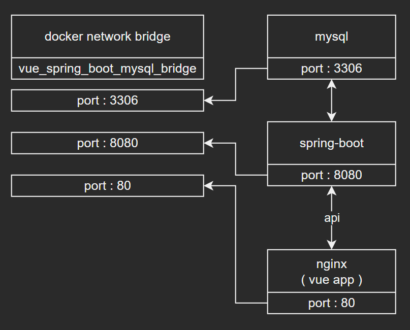

# Vue & SpringBoot & MySQL

## structure


## version
- `Java` : 17

### dependencies
- `springframework.boot` : `3.1.2`
- `spring-boot-starter-data-jpa`
- `spring-boot-starter-security`
- `spring-boot-starter-web`
- `spring-boot-starter-validation`

#### swagger
- `springdoc-openapi-starter-webmvc` : `2.0.4` ( swagger )

#### jwt
- `io.jsonwebtoken:jjwt:0.9.1`
- `javax.xml.bind:jaxb-api:2.4.0-b180830.0359`

#### mysql connecter
- `com.mysql:mysql-connector-j`

## start CMD
``` shell
docker-compose up
```